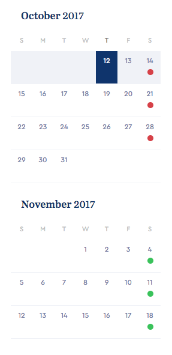

## 달력을 만들자
날짜 계산은 어렵다. JS Date 객체를 활용하기에도 머리아프다. 그냥 Moment.js를 활용해보자.  
Moment.js를 활용해서 날짜, 시간 관련 에러는 따로 생각하자. 달력만드는데만 집중하자.  

### 생각
1. `this week`을 구함. `moment().isoWeek()`.
2. `this week`에 6주를 더함. `for`문으로 6번 돌아서 각각 객체안 배열로 넣음. `this week`에서 `weeks` 배열로 만듦. isoWeek값이 속하는 `month`와 `year`값도 저장함.  
       
    ```javascript
    weeks = [
	    {
	    	week: 0, 
	    	month: 0,
	    	year: 0
		}, 
		{
			week: 0, 
	    	month: 0,
	    	year: 0
    	}
    	... 
	]
    ``` 
3. `today`값을 구함. 이를 `calendar`객체에 추가해줌. `weeks`배열도 추가해줌.

	```javascript
	calendar = {
		weeks : [...],
		today : 0,
		day : today.isoWeekday()
	}
	```
4. `events` 배열 생성, 불러온 데이터를 토대로 지정된 날짜마다 event를 추가.   
	
	```javascript
	events = [
		date: 0,
		type: className
	]
	```
5. `calendar` 객체를 통해서 달력을 생성한다.  
	굉장히 애매하다. ejs를 사용해서 자동으로 템플릿을 생성하는 방법이 있고, pure JS를 사용해서 만들 수도 있다.  
6. isoDate값으로 받아온 week값을 이용해서 한주씩 마크업을 append해나가면 된다.
7. month값이 바뀔경우, month 마크업을 append 시킨다.
8. today 값의 css를 바꿔줘서 '오늘'을 표시하고
9. 이벤트 값에 따라 css 를 추가해준다.
10. weeknum 값으로 클릭시 해당 스케쥴로 스크롤링 되는 이벤트를 만들어준다.
11. 각 월의 전달, 다음달 날짜는 스무스하게 블러? 처리를 해주자.
12. today 이전의 날짜는 안보이게 만들자

## 달력 제작
마크업 부터 시작한다. 벤치마킹을 통해서 구현해보고싶은 달력을 하나 선택했다. 



html 마크업을 짜고, 어울리는 css도 만들어준다. 

```html
<!-- 

basic html5 code block here

-->

<body>


<body>


```

위에서 고민한 내용들을 토대로 자바스크립트 작업을 시작하면 된다. 

먼저, 달력에 대한 데이터를 만들어줘야한다.

```javascript

```


## jQuery 플러그인화 하기

### 업데이트 예정
1. npm 모듈화 하기
2. 리액트 컴퍼넌트화 하기


