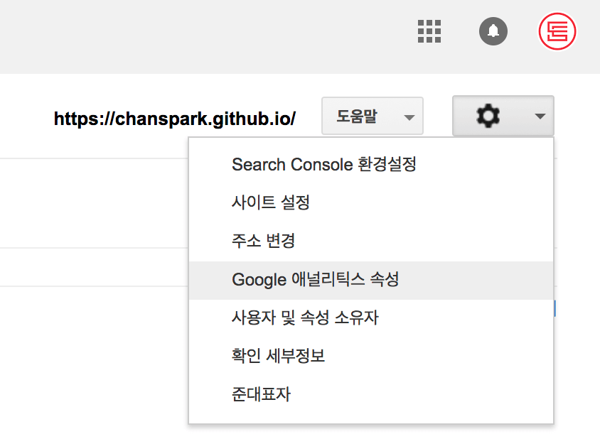
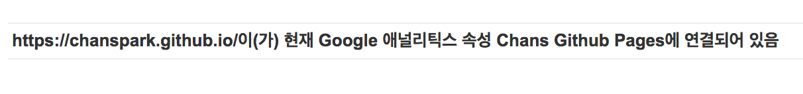
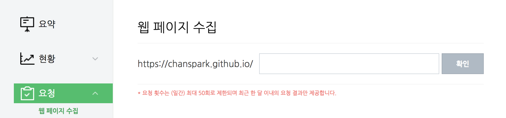

티스토리블로그에서 지킬블로그로 옮기면서 간과했던점이 있습니다. 검색엔진에 얼마나 노출되느냐가 블로그 활성화에 얼마나 중요한지 모르고 있었죠 ㅇㅅㅇ.. 티스토리는 포스트만 작성해도 알아서 네이버와 다음에 노출되며 꾸준히 방문자 숫자가 늘어나게 됩니다. 몇달 관리를 안해도 예전 포스트로인해 방문자수는 계속 늘어나게 되더군요. 

반면에 지킬블로그는 개설하고 포스트를 꾸준히 작성하고 있음에도 불구하고 구글 애널리틱스는 여전히 0이라는 숫자를 나타내고 있었습니다. ㅇㅁㅇ.. 
<!--

-->
몇달간 방문자 숫자가 0명이라니..  후... 그래서 이번 기회에 대대적으로 검색엔진 최적화를 해보았습니다.

## SEO, SEO, SEO
### 구글 애널리틱스 & Search Console
개발자들은 보통 구글을 통해서 검색을하니, 네이버나 다음보다는 구글 애널리틱스에 등록하는것이 좋을 것 같습니다. [구글 애널리틱스](https://www.google.com/analytics/)에 로그인 하시고, 본인 사이트를 등록합니다. 그리고 [구글 Search Console](https://accounts.google.com/signin/v2/identifier?service=sitemaps&passive=1209600&continue=https%3A%2F%2Fwww.google.com%2Fwebmasters%2Ftools%2Fhome%3Fhl%3Dko&followup=https%3A%2F%2Fwww.google.com%2Fwebmasters%2Ftools%2Fhome%3Fhl%3Dko&hl=ko&flowName=GlifWebSignIn&flowEntry=ServiceLogin)에도 사이트를 등록해 줍니다. 사이트를 등록하면 '인증' 을 받아야하는데, 구글이 제공하는 코드를 웹사이트 헤더에 삽입해주면 됩니다. 저는 `google-analytics.html`이라는 파일을 하나 더 만들고, 이를 동적으로 헤더에 삽입해주는 형식으로 코드를 짰습니다. 

``` html
<head> 
	<!-- ... 기타 내용들 ... -->
	
		
	
</head>	
``` 

이런식으로 헤더부분에 삽입해줍니다. 구글 애널리틱스 인증을 마쳤으면, 애널리틱스와 search console을 연동시켜줍니다. 



위 페이지에서 구글 애널리틱스와 연동하면 됩니다. 성공적으로 연동되었을경우 search console 홈페이지에 아래와 같은 메시지가 떠 있는것을 확인 할 수 있습니다.



### 네이버 웹마스터도구
[네이버 웹마스터도구](http://webmastertool.naver.com/)에 접속해서 사이트를 등록해줍니다. 역시는 역시 여기서도 인증을 해야합니다. 여러가지 옵션이 있을텐데 `meta` 태그를 복사해서 헤더에 넣어주는 방법이 가장 간단한것 같습니다. 등록이 되었다면 '웹페이지 수집'을 하도록 모든 버튼을 눌러줍시다. 



저런 '수집'용 버튼들이 많은데, 다 한번씩 눌러주는게 좋은거 같아요. 뇌피셜입니다. 실제로는 아무 효과도 없을지도... 


### robots.txt
로봇(웹 크롤러)들이 우리 사이트를 마음껏 헤집고 다닐 수 있도록 허용해주는? 파일입니다. 특정 페이지를 막아놓을 수도 있고, 특정 로봇만 허용할 수 있는 옵션들이 있지만 저는 아주 관대하기 때문에... 모든걸 허용합니다.

``` html
<!-- robots.txt 파일 내용 -->
# robotstxt.org

User-agent: *
Allow:/
Sitemap: https://chanspark.github.io/sitemap.xml
```

아래에 있는 `Sitemap:` 요녀석은 나중에 사이트맵을 추가했을때 로봇이 읽어올 수 있도록 해주는 '절대경로' 입니다. 본인의 사이트 url로 바꿔주세요. 요 robots.txt파일은 사이트 경로 최상단(루트)에 위치해야합니다.

### metatag
위에 나온것들을 아무리 열심히 등록하고 연동시키고 해봐야 좋은 메타태그가 없다면 아무 소용없습니다. 메타태그는 종류도 엄청 다양하죠. 기본적으로 해당 페이지가 담고 있는 메인 컨텐츠를 '간략하게' 보여주는 것이라고 생각하시면 됩니다. 카톡이나 페북으로 링크를 공유하면, 사이트 제목과 간략한 소개글? 이 뜨는것을 보셨을거에요. 그 기능을 하는거라고 생각하시면 됩니다. 사실 이것저것 만져야할게 많지만 jekyll은 플러그인을 제공해주죠. 아주 편합니다. [지킬 SEO 플러그인](https://github.com/jekyll/jekyll-seo-tag)을 사용하면 됩니다!! 

설치는 다른 지킬 플러그인 설치 방법과 동일합니다. [설치](https://github.com/jekyll/jekyll-seo-tag/blob/master/docs/installation.md)는 여기를 참고하셔도 좋구요. 플러그인을 설치했다면 `bundle` 명령어를 입력해서 플러그인이 제대로 작동하도록 해줍니다. `head`에 ``코드를 추가해주면 모든 설치는 완료되었습니다!

사용하는 방법은 매우 간단합니다. `_config.yml`파일에 필요하다고 생각하는 옵션들을 죄다 넣어주면 됩니다. 옵션들은 [여기](https://github.com/jekyll/jekyll-seo-tag/blob/master/docs/usage.md)를 참고하세요.


### 설치


## 왜 RSS피드인가?
RSS피드는 단순히 웹사이트를 서핑하는 행동들을 좀더 효율적으로 만들어주게 도와주는 툴입니다. 개인적으로는 특정 블로그나 사이트에 업데이트되는 내용을 받아보기위해 사용하였습니다. 하지만 이제는 제 블로그를 검색엔진에 최적화하기 위해서 사용하게 되었네요. 

### 설치
[jekyll-feed 플러그인](https://github.com/jekyll/jekyll-feed) 깃허브에 들어가보면 설치 및 사용법이 자세히 나와있습니다. 


